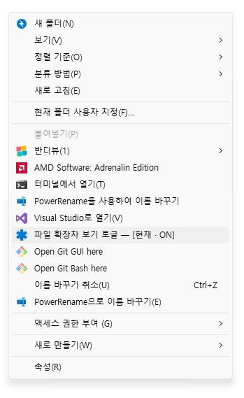

# 파일 확장자 보기 토글 (File Extension Toggle)



## [즉시 다운로드](https://github.com/galaon/FileExtensionToggle/releases/latest/download/FileExtensionToggle.zip)


<BR>누군가는 한번쯤 필요한 상황이 있을 것 같아서 만든,<BR>
내가 파일 여러개 정리하다가 귀찮아서 만든,<BR>
파일 확장자 보기 토글 기능.

아주 간단하게 사용할 수 있습니다.<BR>
설치하고 윈도우, 탐색기 영역에서 마우스 우클릭 하면 보입니다.

아주 간단하게 설치할 수 있습니다.<BR>
다운받고 **Install.bat** 실행해서 설치.<BR>
맘에 안들면 **Uninstall.bat** 실행해서 삭제.

밑에 설명은 AI가 써준거라 보고싶은 사람만 봐도 됩니다.<BR>

-----

For English, see [README.en.md](README.en.md).

Windows 우클릭 메뉴에서 **파일 확장자 표시/숨김**을 한 번에 전환합니다.
폴더 옵션 창을 열 필요도, 탐색기를 재시작할 필요도 없습니다.

- 우클릭 메뉴에 **현재 상태 표시** — `파일 확장자 보기 토글 ― [현재 · ON]`
- 상태에 따라 **아이콘 색도 변경** — ON 은 파랑, OFF 는 회색
- 확인창 없이 **조용히** 전환 (오류가 났을 때만 알림)
- 관리자 권한 **불필요** (현재 사용자 `HKCU` 에만 기록)
- 탐색기 재시작 **불필요** (`SHChangeNotify` 로 즉시 반영)
- **OS 표시 언어를 따라** 한국어/영어 자동 전환
- Windows 기본 구성요소만 사용 (PowerShell + wscript)

## 구성 파일

```
FileExtensionToggle/
├── Install.bat        ← 더블클릭 설치
├── Uninstall.bat      ← 더블클릭 제거
├── README.md          ← 이 문서
├── README.en.md       ← English
├── LICENSE
├── src/               ← 스크립트
│   ├── Install.ps1        우클릭 메뉴에 항목 등록
│   ├── Uninstall.ps1      등록한 메뉴 항목 제거
│   ├── ToggleFileExt.ps1  실제 토글 (HideFileExt 반전 + 탐색기 갱신 + 메뉴 갱신)
│   ├── Run-Hidden.vbs     콘솔 창 없이 토글을 실행하는 런처
│   └── Lang.ps1           한국어/영어 문자열 테이블
└── icons/             ← 아이콘
    ├── icon-on.ico        확장자 표시(ON) - 파랑
    ├── icon-off.ico       확장자 숨김(OFF) - 회색
    └── icon-source.svg    원본 SVG
```

평소에는 루트의 `Install.bat` / `Uninstall.bat` 두 개만 쓰면 됩니다.

## 설치

**`Install.bat` 을 더블클릭하십시오.** 그게 전부이고, 관리자 권한도 필요 없습니다.

`.bat` 이 내부에서 `-ExecutionPolicy Bypass` 로 PowerShell 을 부르므로
시스템 실행 정책을 따로 바꿀 필요가 없습니다.

언어를 강제하거나 메뉴 이름을 바꾸려면 스크립트를 직접 실행합니다:

```powershell
powershell -ExecutionPolicy Bypass -File ".\src\Install.ps1" -Language en
powershell -ExecutionPolicy Bypass -File ".\src\Install.ps1" -MenuText "확장자 보기"
```

등록 위치는 `HKCU` 세 곳입니다 — 폴더 빈 공간, 바탕화면, 폴더 아이콘.

## 사용

바탕화면이나 탐색기 폴더의 빈 공간을 우클릭 →
**파일 확장자 보기 토글 ― [현재 · OFF]** 클릭.

- 클릭하면 **아무 창도 뜨지 않고** 즉시 전환됩니다.
- 열려 있는 탐색기 창이 **새로고침 없이 바로** 갱신됩니다.
- 다시 우클릭하면 라벨이 **`[현재 · ON]`** 으로, 아이콘은 파란색으로 바뀌어 있습니다.

`ON` = 확장자 보임, `OFF` = 확장자 숨김.

> **Windows 11 사용자 주의**
> 간소화된 새 우클릭 메뉴에는 레지스트리 방식 항목이 나타나지 않습니다.
> **[추가 옵션 표시]** 를 누르거나 `Shift + F10` 으로 클래식 메뉴를 여십시오.

## 제거

**`Uninstall.bat` 을 더블클릭하십시오.** 메뉴 항목만 지우고, 확장자 설정 자체는 그대로 둡니다.

## 동작 원리

레지스트리 값 하나를 뒤집습니다.

```
HKCU\Software\Microsoft\Windows\CurrentVersion\Explorer\Advanced
    HideFileExt (DWORD)
        1 = 확장자 숨김 (Windows 기본값)
        0 = 확장자 표시
```

값을 바꾼 뒤 `shell32.dll!SHChangeNotify(SHCNE_ASSOCCHANGED, SHCNF_FLUSH, ...)` 를 호출해
열려 있는 탐색기 창을 갱신합니다. `SHCNF_FLUSH` 는 알림이 실제로 처리될 때까지 기다리게 하므로
반영이 즉각적입니다. 탐색기를 강제 종료하지 않으니 열어둔 창과 작업 상태가 유지됩니다.

### 메뉴에 상태가 표시되는 원리

Explorer 는 메뉴를 열 때마다 **라벨과 아이콘을 레지스트리에서 다시 읽습니다.**
그래서 토글 직후 각 메뉴 키의 기본값을

```
파일 확장자 보기 토글 ― [현재 · ON]
```

처럼 새로 쓰고, `Icon` 값도 `icon-on.ico` / `icon-off.ico` 로 바꿔 씁니다.
원래 이름은 `BaseMenuText`, 설치 시 언어는 `LangCode` 값에 보관해 두고 매번 재조립합니다.
덕분에 COM 셸 확장 DLL 없이도 라벨과 아이콘이 상태를 따라갑니다.

## 아이콘

[Pinhead Map Icons 의 `heavy-six-point-asterisk`](https://icon-sets.iconify.design/pinhead/heavy-six-point-asterisk/) 를
16 / 20 / 24 / 32 / 48 / 64 / 128 / 256 px 이 모두 담긴 멀티사이즈 `.ico` 두 개로 변환했습니다.

| 파일 | 상태 | 색 |
|------|------|-----|
| `icon-on.ico` | 확장자 **표시** (ON) | 파랑 `#0078D4` |
| `icon-off.ico` | 확장자 **숨김** (OFF) | 회색 `#808080` |

두 색 모두 밝은 메뉴와 어두운 메뉴 양쪽에서 잘 보이도록 골랐습니다.
설치할 때 이 두 파일은 **`%LOCALAPPDATA%\FileExtensionToggle\icons\`** 로 복사되고,
우클릭 메뉴에는 그 사본의 경로가 등록됩니다. 프로젝트 폴더를 옮기거나 지워도 메뉴 아이콘이
깨지지 않으며, 평소 손이 닿을 일 없는 위치라 실수로 건드릴 염려도 없습니다.
`Uninstall.bat` 을 실행하면 이 폴더도 함께 지워집니다.

다른 아이콘을 쓰려면 `icons/` 안의 `.ico` 두 개를 같은 이름으로 바꿔 넣고
`Install.bat` 을 다시 실행하십시오 (사본이 갱신됩니다).

## 참고 / 제약

- **폴더를 옮기면 메뉴가 깨집니다.** 스크립트 경로가 절대경로로 기록되기 때문입니다.
  옮긴 뒤 새 위치에서 `Install.bat` 을 다시 실행하십시오 (같은 키를 덮어씁니다).
  아이콘은 `%LOCALAPPDATA%` 로 복사되므로 폴더 이동의 영향을 받지 않습니다.
- 아이콘을 바꿨는데 메뉴에 그대로라면 탐색기의 아이콘 캐시 때문입니다.
  `Install.bat` 을 다시 실행하거나 탐색기를 재시작하면 반영됩니다.
- `[현재 · XX]` 와 아이콘 색은 **이 도구로 토글할 때** 갱신됩니다. 폴더 옵션 창이나 다른 프로그램으로
  설정을 바꾸면 잠시 어긋날 수 있고, 메뉴를 한 번 클릭하면 다시 맞습니다.
  매 순간 정확히 맞추려면 동적 컨텍스트 메뉴 핸들러(COM DLL)가 필요합니다.
- 언어는 설치 시점의 Windows 표시 언어로 정해져 메뉴 항목에 저장됩니다.
  표시 언어를 바꿨다면 `Install.bat` 을 다시 실행하십시오.
- 성공 시에는 아무 창도 뜨지 않습니다. 오류일 때만 6초짜리 알림이 뜹니다.

## 라이선스

이 저장소의 코드는 [MIT License](LICENSE) 를 따릅니다.
만든사람 : 방모씨

아이콘은 [Pinhead Map Icons](https://github.com/waysidemapping/pinhead) (제작: Quincy Morgan) 의
`heavy-six-point-asterisk` 이며, 원본은 **CC0 1.0 (공개 도메인)** 입니다.
